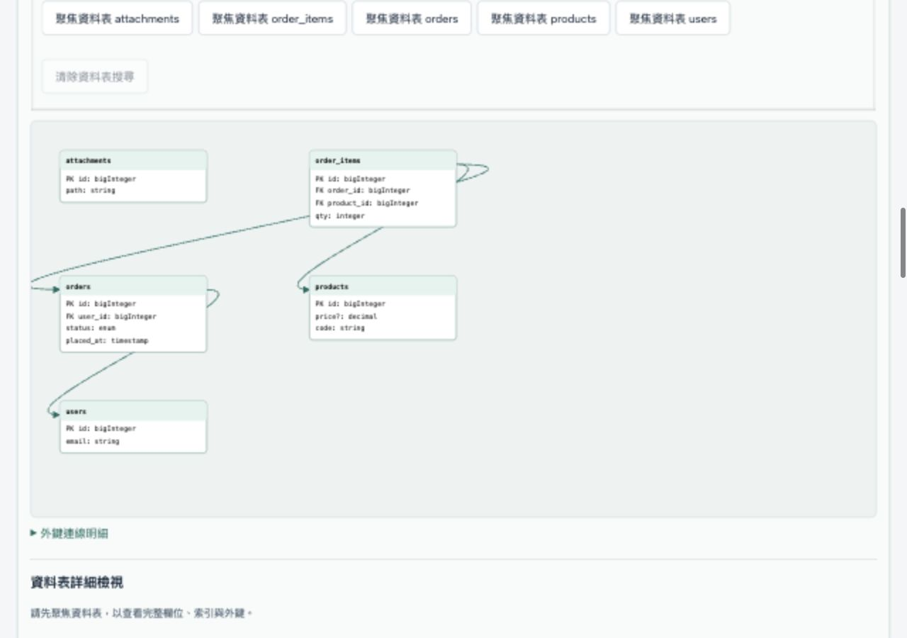

# Laravel Migration Visualizer

[](https://github.com/jerryyehself/laravel-migration-visualizer/actions/workflows/ci.yml) · [部署紀錄](https://github.com/jerryyehself/laravel-migration-visualizer/deployments/github-pages)

把 Laravel migrations 轉成可檢視的資料庫結構，理解每份 migration 改了哪些資料表、欄位、索引與外鍵。

這是一個 **React + TypeScript + Vite 的靜態分析工作台**：使用 glayzzle/php-parser 讀取 PHP AST，分析 `up()`，不執行 PHP、不連接資料庫。檔案在瀏覽器本地讀取，不會上傳至伺服器。

**第一版已交付：產品／web `1.0.0`，migration-core `0.14.0`。** [線上工作台](https://jerryyehself.github.io/laravel-migration-visualizer/) · [版本與交付包](https://github.com/jerryyehself/laravel-migration-visualizer/releases/tag/v1.0.0) · [使用手冊](docs/user-guide.zh-TW.md) · [相容性矩陣](docs/compatibility.zh-TW.md)

## 畫面預覽



十二檔訂單系統範例的實際工作台畫面：五張資料表、三個明確外鍵。圖片來自本地瀏覽器驗收；多型欄位不會被推測成外鍵。

## 可以做什麼

- **多檔分析**：匯入 PHP 檔案或 migrations 資料夾，由 core 按檔名排序並逐份分析。
- **可信快照**：查看每份 migration 的 `schemaBefore`、`schemaAfter`、operations 與結構 diff。
- **ERD 視覺化**：選初始、最終或逐檔快照，查看資料表、欄位與明確外鍵；支援資料表／欄位搜尋、聚焦、拖移、縮放與表明細。
- **前後比較**：兩張真實快照標記新增／移除／變更，同步畫面位置與互動。
- **診斷修正**：定位 PHP 原始碼行，編輯工作台副本、還原，再重新分析。
- **JSON 匯出**：保存完整分析或可信的最終 Schema；不包含 PHP 原始碼與 ERD 位置。
- **學習範例**：內建成功／失敗、索引／外鍵、Laravel 12 官方樣本與十二檔訂單系統範例。

## 快速開始

需要 **Node.js 22.12+** 與 npm；不需要 PHP、Composer、資料庫或 API key。

```sh
git clone https://github.com/jerryyehself/laravel-migration-visualizer.git
cd laravel-migration-visualizer
npm ci
npm run dev
```

開啟終端顯示的網址。若要指定本機 port：

```sh
npm run dev -- --host 127.0.0.1 --port 5202 --strictPort
```

正式建置與預覽：

```sh
npm run build
npm run preview -- --host 127.0.0.1 --port 5202 --strictPort
```

請透過 HTTP 預覽，不要直接以 `file://` 開啟 `dist/index.html`。若 port 已被占用，改用其他 port。

## 第一次使用

1. 在「多檔專案」按 **載入訂單系統範例（12 檔）**，再按 **分析專案**。預期 12／12 套用成功、零診斷、五張表與三個外鍵。
2. 分析自己的專案時，選取 UTF-8 `.php` 檔或 `database/migrations` 資料夾。匯入會取代目前清單；資料夾包含子目錄，非 PHP 檔案會略過並列出。
3. 從 ERD 快照選單查看最終結構或逐檔前後比較，聚焦資料表查看完整屬性；也可搜尋目前快照的欄位，點結果直接展開並定位明細。
4. 若有診斷，按「定位原始碼」再跳到輸入區修改副本。修改會清除舊結果，需重新分析；不會改動磁碟上的 migration。

檔名須符合 `YYYY_MM_DD_HHMMSS_description.php`。Core 依 basename 字串排序，保留來源路徑；不驗證日曆日期。格式錯誤或重複名稱會阻止專案 replay，匯入順序不影響分析順序。

## 成功、失敗與未知狀態

`complete` 表示支援範圍內的靜態分析成功，不保證真實資料庫能執行。

| 狀態 | 意義 |
|---|---|
| `applied` | 整份 migration 已成功套用到分析模型，有可信 before／after／diff。 |
| `failed` | 沒有套用部分操作；首個失敗檔保留可信 before，after／diff 為 `null`。 |
| `blocked` | 前序失敗，仍分析 PHP，但不猜測後續快照。 |

失敗專案的 `finalSchema` 為 `null`；`lastValidSchema` **只代表成功前綴**。未知快照不會被畫成空白或完整 ERD，最終 Schema 匯出也會停用。結構 diff 不推測語意上的 rename，實際改名顯示為移除與新增。

## 支援範圍

只分析一個匿名／具名 Migration 類別的 `up()`，支援 namespace、use alias 與完整 facade 名稱。以下是概覽；完整參數與拒絕規則以 [相容性矩陣](docs/compatibility.zh-TW.md) 及各階段教學為準。

| 類別 | 支援概覽 |
|---|---|
| Schema | `create`、`table`、`rename`、`drop`、`dropIfExists` |
| 欄位 | 自增／整數家族、string／char／text、boolean、date／時間、decimal、json／jsonb、uuid、enum |
| 修飾 | `nullable`、`unsigned`、靜態 scalar `default`、`comment`、時間欄位 current metadata |
| 欄位變更 | `renameColumn`、單欄或靜態陣列 `dropColumn`、保守子集合的 `change` |
| 索引 | index／unique／primary、移除、一般 index／unique 更名 |
| 外鍵 | foreign／references／on、foreignId／constrained、actions、移除外鍵與慣例外鍵欄位 helper |
| Helpers | timestamps、softDeletes、rememberToken 與對應移除；明確 numeric／UUID morph helpers、`dropMorphs` |

多型 helpers 不推測目標外鍵；`useCurrent`／`useCurrentOnUpdate` 保存資料庫時間意圖，不產生目前時間值。外部 `initialSchema` 必須符合現行契約，每張表必須有 `indexes` 與 `foreignKeys`；不自動升級或驗證任意外部 JSON。

## 架構：core 與 UI 分離

```text
PHP 字串 → php-parser AST → AtomicOperation → SchemaState → SchemaDiff
                                migration-core
                                      ↓ props
                               React 工作台／ERD
```

```text
packages/migration-core/
  src/
    parser.ts          PHP parser 邊界
    normalize.ts       AST 正規化與診斷
    types.ts           操作與 SchemaState 契約
    ordering.ts        migration 檔名排序
    schema.ts          不可變的 schema replay
    diff.ts            結構比較
    project.ts         多檔分析與可信快照
    project-types.ts   專案分析契約
  tests/fixtures/      PHP 樣本與獨立定義的 golden JSON
apps/web/
  src/components/     輸入、結果、診斷與 ERD
  src/import-files.ts 瀏覽器 UTF-8 讀檔
  src/main.tsx        工作台模式切換
  tests/              UI adapter 與跨層契約驗證
examples/             Node 範例與規模觀察
scripts/              驗證與交付包工具
docs/                 中文教學、手冊、決策及交付紀錄
```

Component 是畫面的一塊，props 傳入資料，state 保存使用者目前的輸入與選擇。Parser、排序、schema replay、diff 與診斷都在純 TypeScript core；core 不讀檔、不使用 React hooks，UI 不自行推算 schema。

多檔分析 API 可由其他 TypeScript／Node 呼叫端使用；讀檔放在呼叫端：

```ts
import { analyzeProject } from '@lmv/migration-core';

const result = analyzeProject([
  { filename: '2026_01_02_000000_update_users.php', source: updatePhp },
  { filename: '2026_01_01_000000_create_users.php', source: createPhp },
]);

for (const step of result.migrations) {
  console.log(step.filename, step.status, step.schemaBefore, step.schemaAfter, step.diff);
}
if (result.complete) console.log(result.finalSchema);
else console.log(result.diagnostics, result.lastValidSchema);
```

`updatePhp`／`createPhp` 為呼叫端讀取的 PHP 字串。Core 也提供 `analyzeMigration`、`applyOperations`、`emptySchema`、`orderMigrations` 與 `diffSchemas`；建置後的套件範例見 `examples/`。

## 驗證與版本交付

```sh
npm run verify
npm run demo:project
npm run demo:acceptance
```

`verify` 串接 tests、typecheck、build 與十一個 built-package demos，失敗即停止。v1.0.0 交付基準為 **612 tests（520 core + 92 web）**；本地、CI 與解壓 source 重建均通過。Golden 由預期規格獨立定義，不盲目錄製分析器輸出。

`demo:acceptance` 包含十二檔自撰專案及 250／1000 檔 core correctness；它不是任意真實 Laravel 專案相容或大型瀏覽器效能保證。

```sh
npm run release:bundle
```

產包需要乾淨 Git checkout、Git 與 tar。先驗證目前 HEAD，再產生 `artifacts/` 下的 source／built web／驗證紀錄／SHA-256 manifest 與 archive checksum。包內沒有 `node_modules`／`.git`；解壓 source 可安裝、驗證及建置，重新產包需 clone repo。時間與環境資訊使 archive 不保證跨平台位元組相同。

## 已知限制

- 靜態 Laravel API 子集合；不執行動態 PHP、條件／迴圈、macros、任意 SQL 或資料庫 DDL，不保證完整 Laravel／DB 方言相容。
- 完整快照隨 schema 成長消耗記憶體；目前同步分析，沒有 Web Worker 或大型 UI 效能保證。
- 沒有草稿持久化。重新整理或切換工作台會失去輸入／結果，編輯不回寫原始 PHP。
- timeline、`down()`、AI、SQL parser、runtime migration execution、semantic refactoring detection 不在第一版。
- JSON 匯出功能保留；**依使用者目前要求，暫緩下載互動與落盤驗收**。歷史下載自動化逾時不視為已驗證，這次 README 更新不測下載。
- 產品／web `1.0.0` 與 core `0.14.0` 分開版本化；套件仍 private，沒有 npm 發布；線上版由 GitHub Pages 提供。

## GitHub Pages

單一 repo 的 GitHub Actions 從 main 驗證與建置，再發布 apps/web/dist。手動重新發布用 npm run publish:pages，或在 Actions 執行 Deploy GitHub Pages。2026-10-04 首次部署已成功，線上工作台可使用；切換紀錄見 [單一 repo 發布](docs/single-repo-publication.zh-TW.md)。


## 文件與開發紀錄

| 文件 | 用途 |
|---|---|
| [使用手冊](docs/user-guide.zh-TW.md) | 安裝、第一次分析、診斷處理與交付包 |
| [相容性矩陣](docs/compatibility.zh-TW.md) | 支援／拒絕範圍與證據 |
| [React 與分層教學](docs/tutorial.zh-TW.md) | component、props、state 與 core/UI 設計 |
| [M2 專案分析](docs/milestone-2.zh-TW.md) | 排序、batch、快照與失敗契約 |
| [第一版交付說明](docs/release-v1.zh-TW.md) | 版本、驗證與產包規則 |
| [GitHub 交付紀錄](docs/github-milestones.md) | M1～M33 的實際 issues、PR、commit 與 CI |
| [決策索引](docs/DECISIONS.zh-TW.md)／[交接文件](docs/CLOUD_HANDOFF.md) | 本地／雲端接手與範圍延續 |

修改專案前請讀 [AGENTS.md](AGENTS.md) 與 repo 內 `.agents/skills/`；新功能走分支／PR，確認最新 HEAD CI 後再合併。

## 原始碼公開前檢查

2026-10-04 已經使用者核准清理所有分支／tag 的私人對話匯出與個人 email，重建 v1.0.0 附件，再將來源 repo 轉為公開。私人備份保留在 repo 外；架構決策與教學仍保留。GitHub 舊 PR diff／commit cache 可能仍有歷史副本，不能宣稱已完全清除；詳見 [發布紀錄](docs/single-repo-publication.zh-TW.md) 與 [原始檢查](docs/publication-audit.zh-TW.md)。

`nullableTimestamps()` 與單一靜態非負整數 precision 已支援，展開兩個 nullable timestamp 欄位。明確 null、動態參數、修飾鏈與 change 拒絕；不含 nullableTimestampsTz。core 0.15.0，JSON 形狀不變；來源與樣本限制見 [M37 教學](docs/milestone-37.zh-TW.md)。

表／欄位明細可列出名稱直接涉及的 migration 操作，跳到唯讀 PHP 來源並返回原快照選取；不推測 rename 身分或把 failed／blocked 語法操作當成生效。實作與交付狀態見 [R4 說明](docs/r4-operation-sources.zh-TW.md)。
